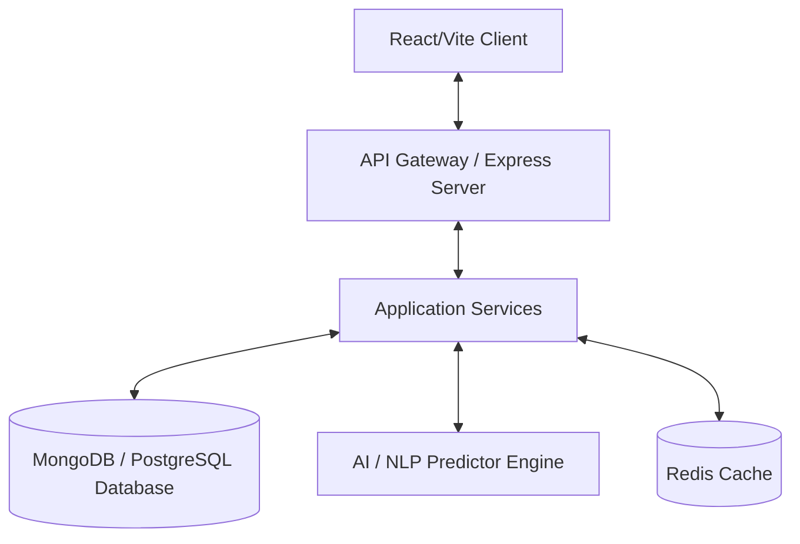

<div align="center">
  
# 🛍️ Intelligent Retail AI Platform

*A smart retail ecosystem that thinks, predicts, and assists — not just a shopping website.*

[](https://reactjs.org/)
[](https://nodejs.org/)
[](https://www.typescriptlang.org/)
[](https://tailwindcss.com/)
[](https://www.mongodb.com/)
[](https://pnpm.io/)

</div>

---

Building the future of e-commerce, the **Intelligent Retail AI Platform** acts as both a **Smart Shopping Assistant** for customers and an **Intelligent Decision-Support System** for retailers. It leverages real-time data, complex predictive modeling, and AI to redefine product discovery, automate workflows, and optimize every aspect of retail operations.

## 📑 Table of Contents
- [✨ Core Features](#-core-features)
- [🏗️ High-Level Architecture](#-high-level-architecture)
- [💻 Tech Stack](#-tech-stack)
- [📂 Monorepo Structure](#-monorepo-structure)
- [🚀 Getting Started](#-getting-started)
- [⚙️ Configuration](#-configuration)
- [🧪 Testing](#-testing)
- [🛡️ Security & Accessibility](#-security--accessibility)
- [🤝 Contributing](#-contributing)
- [📄 License](#-license)

---

## ✨ Core Features

### 🛒 Customer Experience
| Feature | Description |
| :--- | :--- |
| **🤖 AI Shopping Assistant** | Conversational interface that understands intent-based NLP queries (e.g., *"best phone under $300 for gaming"*) and provides easily explainable recommendations. |
| **🎯 Hyper-Personalization** | A dynamic UI that continually adapts to browsing behavior, purchase history, and implicit user preferences for a 1-to-1 tailored journey. |
| **🔍 Smart Search** | Semantic search driven by NLP, coupled with intelligent auto-suggest, intent prediction, and Google Vision API integrations. |
| **🔮 Predictive Shopping** | Smart reminders for cyclical repeat purchases and contextual *"You may need this next"* upsell recommendations. |

### 📈 Retailer Optimization
| Feature | Description |
| :--- | :--- |
| **📊 Demand Forecasting** | Predicts future product demand using historical data to preemptively identify trends and seasonal spikes. |
| **📦 Inventory Optimization** | Automatically detects low-stock or overstock scenarios and immediately suggests restocking actions to avoid missed sales. |
| **💰 Dynamic Pricing** | Recommends optimal pricing intelligently adjusted based on current demand, broader market trends, and competitive analysis. |
| **⚡ Automated Workflows** | Auto-generates real-time alerts for low stock, high demand, and slow-moving products to drastically reduce manual monitoring. |

---

## 🏗️ High-Level Architecture

The platform follows **Clean Architecture** principles (Controller → Service → Repository), ensuring high maintainability and scalability.



---

## 💻 Tech Stack

- **Frontend Environment**: React, Vite, Tailwind CSS, Radix UI (shadcn/ui style components), React Query.
- **Backend Environment**: Node.js, Express.js (or Spring Boot equivalent logic).
- **Architecture Details**: Standardized OpenAPI 3.0 Specs, Zod Validation Schemas, Orval Type Generation.
- **Database**: MongoDB (via Mongoose) / PostgreSQL (via Drizzle ORM).
- **Google Integrations**: Google OAuth, Cloud Vision API, Firebase Analytics.
- **DevOps**: `pnpm` Workspaces (Monorepo).

---

## 📂 Monorepo Structure

Our codebase is deeply integrated using a robust `pnpm` monorepo design pattern to cleanly separate concerns while maximizing code reuse.

```text
intelligent-retail-ai/
├── artifacts/
│   ├── api-server/         # Main Express.js backend services
│   ├── mockup-sandbox/     # Isolated UI sandbox for testing components
│   └── retail-platform/    # The primary React user-facing application
├── lib/
│   ├── api-client-react/   # Auto-generated React Query hooks & fetch definitions
│   ├── api-spec/           # The Single Source of Truth: OpenAPI specification (.yaml)
│   ├── api-zod/            # Auto-generated Zod validation schemas
│   └── db/                 # Centralized Database schemas & ORM setup
├── scripts/                # CI/CD pipelines, generation scripts, environment setup
└── package.json            # Root workspace configurations
```

---

## 🚀 Getting Started

### Prerequisites
Before you begin, ensure you have met the following requirements:
* **Node.js**: `v18.0.0` or higher
* **pnpm**: `v8.0.0` or higher (`npm install -g pnpm`)
* **Database**: running instance of MongoDB or PostgreSQL

### Local Development Setup

1. **Clone the repository**
   ```bash
   git clone https://github.com/yourusername/intelligent-retail-ai.git
   cd intelligent-retail-ai
   ```

2. **Install Workspace Dependencies**
   ```bash
   pnpm install
   ```

3. **Generate API Clients & Schemas**
   *Compile the OpenAPI spec into Zod and React-Query hooks:*
   ```bash
   # Run the generation script from the root
   pnpm run generate
   ```

4. **Start the Platform**
   ```bash
   # Starts the backend, frontend, and heavily cached UI instances concurrently
   pnpm run dev
   ```

---

## ⚙️ Configuration

Create a `.env` file in `artifacts/api-server/` using `.env.example` as a template:

```env
# Server
PORT=5000
NODE_ENV=development

# Database
DATABASE_URL=mongodb://localhost:27017/intelligent_retail

# Security / Auth
JWT_SECRET=your_super_secret_jwt_key
GOOGLE_CLIENT_ID=your_google_oauth_client_id

# AI APIs
GOOGLE_VISION_API_KEY=your_vision_api_key
```

---

## 🧪 Testing

We adhere strictly to test-driven and quality-assured methodologies, aiming for **> 70% overall test coverage**.

* `pnpm test:unit` - Run unit tests (focused on Service layers).
* `pnpm test:integration` - Run integration tests (validating API endpoints against mocked DBs).
* External API calls (Google Vision, AI Inference) utilize tightly controlled MSW (Mock Service Worker) intercepts.

---

## 🛡️ Security & Accessibility

* **Authentication & Authorization**: Comprehensive stateless JWT implementations, Role-Based Access Controls (Admin/User), and bcrypt hashing.
* **Network & Entry Protection**: Helmet-based header protections, Rate Limiting, standard sanitization against SQLi/NoSQLi and XSS vulnerabilities.
* **Accessibility (A11Y)**: The frontend targets pristine WCAG compliance using Radix primitives—enabling intuitive keyboard navigation, full screen-reader friendliness via robust ARIA states, and guaranteed contrast minimums.

---

## 🤝 Contributing

We welcome contributions! Please follow these steps to contribute:
1. Fork the project.
2. Create your Feature Branch (`git checkout -b feature/AmazingFeature`).
3. Commit your Changes (`git commit -m 'feat: add some AmazingFeature'`).
4. Push to the Branch (`git push origin feature/AmazingFeature`).
5. Open a Pull Request.

Please review our [Contributing Guidelines](CONTRIBUTING.md) for more details on conventional commits and architecture requirements.

---

## 📄 License

Distributed under the MIT License. See `LICENSE` for more information.

---
<div align="center">
  <b>Built with ❤️ by the Intelligent Retail Team</b>
</div>
